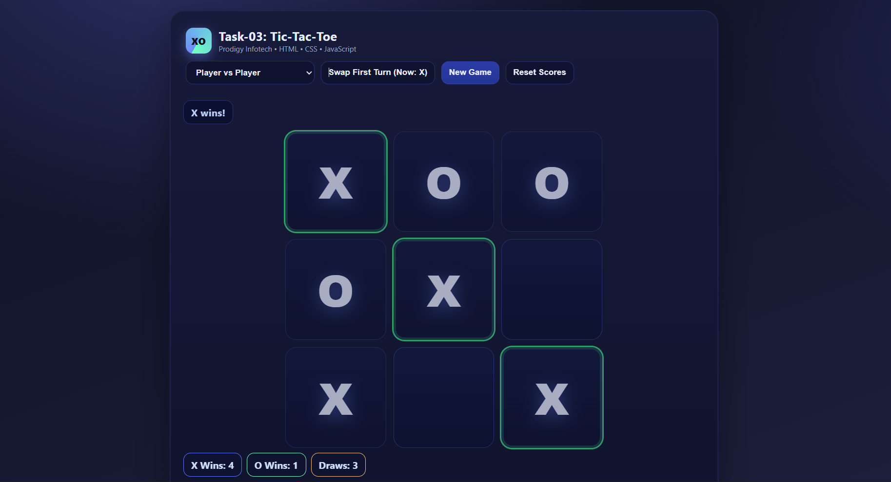
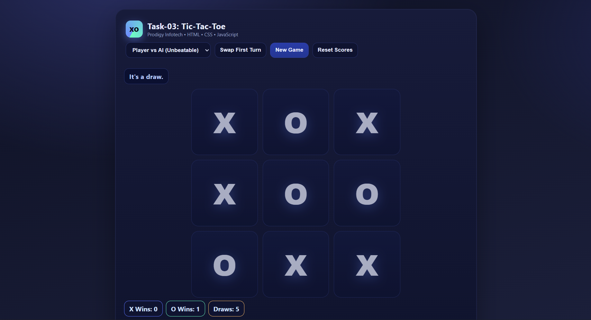

# 🎮 Task-03: Tic-Tac-Toe  

A simple and fun Tic-Tac-Toe game built with **HTML, CSS, and JavaScript**.  
This project was created as part of my internship at **Prodigy InfoTech**.  

---

## 🚀 Live Demo  
🔗 [Play the game here](https://ayushbadola74.github.io/PRODIGY_WD_03/)  

---

## ✨ Features  
- 🎯 Player vs Player Mode  
- 🤖 Player vs AI (Unbeatable using Minimax Algorithm)  
- 🔄 Swap First Turn  
- 🆕 Start New Game  
- 🧹 Reset Scores  

---

## 📸 Screenshots  

### 🕹️ Game Board

### 🏆 Game Over Modal

---

## 🛠️ Tech Stack  
- **HTML5**  
- **CSS3**  
- **JavaScript (ES6+)**  

---

## 🙌 Credits  
- Developed by **Ayush Badola**  

